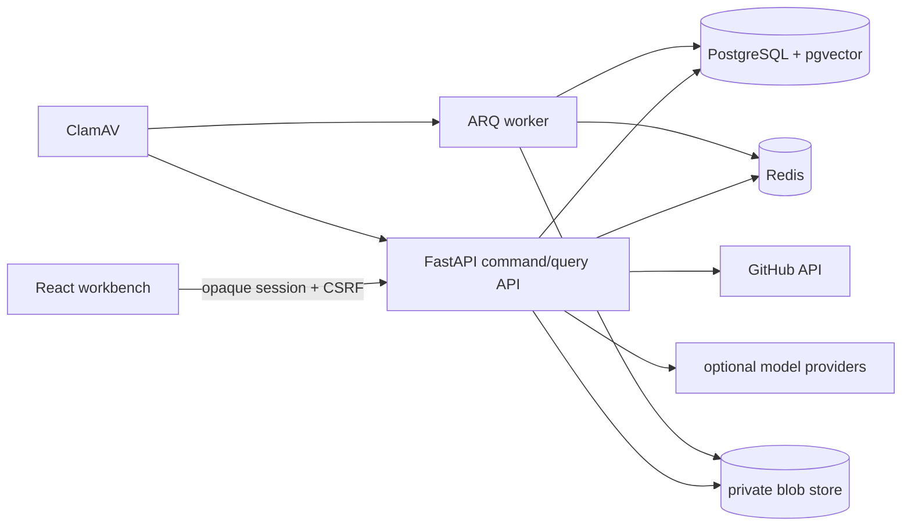
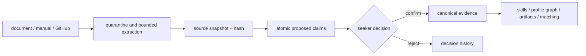
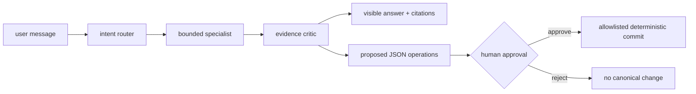
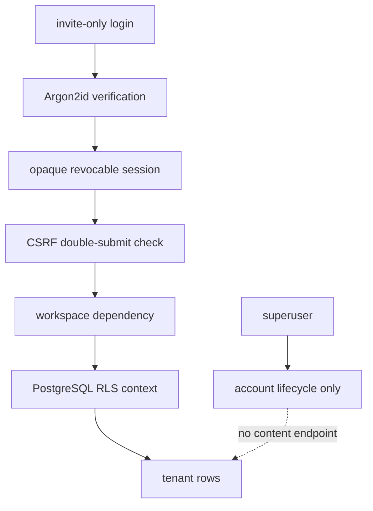
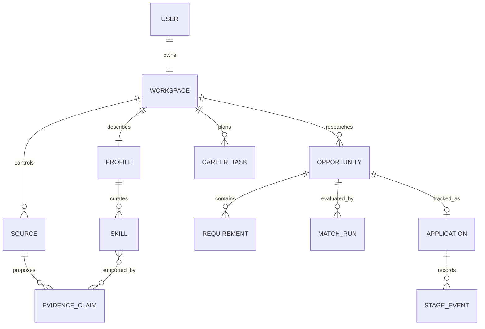
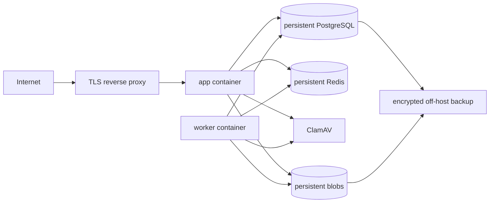

# Architecture

CareerTwin is a modular monolith with explicit deterministic and probabilistic lanes. The monolith keeps transactions and tenant boundaries understandable for a personal self-hosted system; worker processes handle slow or resumable jobs. PostgreSQL is canonical, while graph and chart structures are projections, not independent truth stores.

## 1. System view

The browser never receives provider keys or storage paths. The API validates tenant ownership and sets PostgreSQL session context. The worker repeats that context before processing a private source.

## 2. Evidence lifecycle

Extractors never update canonical profile fields. A claim retains source ID, locator, confidence, lifecycle state, and decision note.

## 3. Agent view

The first alpha stores durable `AgentRun` state and visible conversation records. Production checkpoint integration is designed around PostgreSQL; canonical mutation remains outside the model graph.

## 4. Tenant/security view

Application scoping and forced RLS are defense in depth. Owners/migration roles must be separated from the runtime role in production because table owners can bypass RLS unless forced and correctly configured.

## 5. Domain/data view

## 6. Deployment view

`compose.yaml` includes a one-shot migration service and health-gated app/worker services. Production adds a reverse proxy, secret injection, resource limits, monitoring, and scheduled backup/restore verification.

## Code map

- `backend/careertwin/models.py`: relational domain.
- `backend/careertwin/api/`: authenticated command/query endpoints.
- `backend/careertwin/services/`: deterministic ingestion, graph, matching, recommendation, artifact, security, and connector services.
- `backend/careertwin/agent/`: provider abstraction and bounded graph.
- `backend/careertwin/worker.py`: resumable ingestion, retention, and reminder seams.
- `frontend/src/pages/`: user workflows.
- `frontend/src/components/Visualizations.tsx`: graph/chart projections with accessible alternatives.
