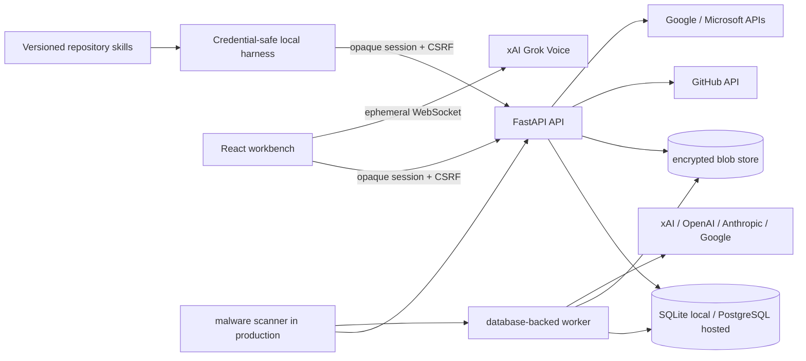
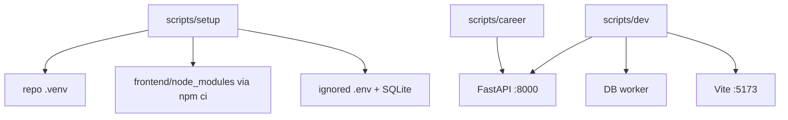
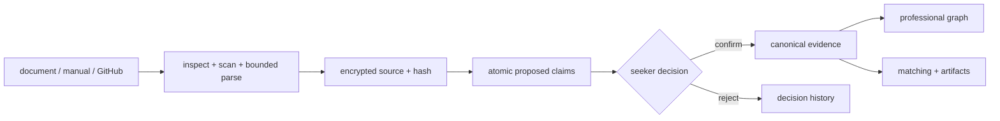
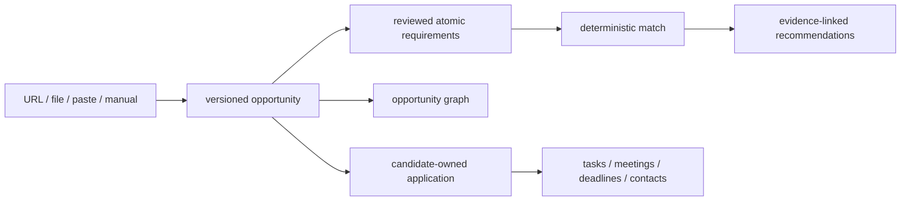
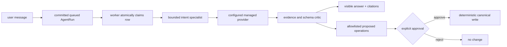
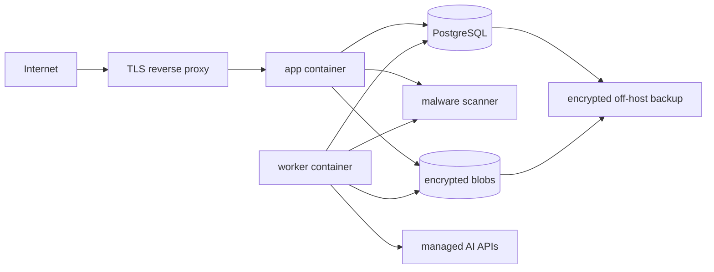

# Architecture

CareerTwin is a native-first modular monolith with deterministic domain services, typed graph
projections, an external-only probabilistic lane, and a database-backed worker. The repository is
the product; the CLI harness and web workbench are peer interfaces. Authenticated web views render
through the registry-pinned `@fasl-work/caos-app-shell` `WorkbenchShell`; CareerTwin owns product state
and controls while the package owns frame, route and landmark semantics.

## System view

No local or VPS process performs LLM, OCR, embedding, or audio inference. The browser never receives
long-lived provider keys or blob paths. Voice uses a short-lived server-minted client secret.

## Native process view

Docker is absent from this path. The POSIX and PowerShell scripts resolve the repository root, reject
unsupported runtimes, and never install Python or Node dependencies globally.

## Evidence lifecycle

Supported text formats parse natively. Image/scanned-PDF content uses xAI only when configured;
uploaded remote files have a TTL safety net and are deleted immediately after processing. Every
extractor output remains proposed and quotation-bound.

## Opportunity lifecycle

The opportunity graph shares requirement concept nodes across roles and adds employer, industry,
seniority, location, work-mode, and target-set relationships. It describes only the user's saved
research universe.

## Agent lifecycle

Queued work is canonical database state. Retry creates a child attempt; cancellation and terminal
transitions acquire the row. Interrupted in-flight provider work fails conservatively rather than
being replayed silently.

## Tenant and storage view

One account owns exactly one seeker workspace. Every domain query includes the workspace boundary;
hosted PostgreSQL adds forced RLS defense. A superuser can create, disable, restore, revoke, and purge
accounts but has no other-user profile/job/conversation browser.

SQLite is the complete local/single-user profile. PostgreSQL is the hosted multi-user profile.
Relational rows are canonical. Graphs, matrices, chart series, search indexes, and scores are
recomputable projections with version/digest provenance.

## Hosted deployment view

Compose is optional packaging. The hosted profile contains no Redis, Ollama, Docling, embedding
server, model volume, or inference initializer.

## Code map

- `backend/careertwin/models.py`: canonical relational domain and durable work state.
- `backend/careertwin/api/`: authenticated command/query endpoints.
- `backend/careertwin/services/`: ingestion, graph, matching, recommendation, artifact, security, and connector services.
- `backend/careertwin/agent/`: typed external providers, prompt contracts, routing, and critic.
- `backend/careertwin/worker.py`: database claiming, source processing, agent execution, retention, and reminders.
- `backend/careertwin/harness.py`: repository-skill automation surface.
- `frontend/src/pages/`: human workflows.
- `frontend/src/components/Shell.tsx`: CareerTwin controls slotted into the shared authenticated frame.
- `frontend/src/components/Visualizations.tsx`: network/matrix/table and chart projections.
- `.agents/skills/`: versioned local operating workflows.
