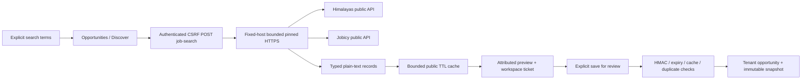

# Job discovery design

## Design review before code

2026-10-03: reviewed against the verified [research](../../../research/job-discovery-2026-10-03.md),
existing ADR 0026 native/external-only boundary, tenant/RLS contracts and the viewport workbench.
Review corrections: provider-specific geographic controls (Jobicy has no Chile slug), support both
timestamp units and location shapes, no result HTML, no client-supplied import content, no polling,
no new migration, and no equation claiming a market-wide or hiring score. Product scope remains
the user-approved candidate-side system; no hiring/employer automation is introduced.

## Flow and interfaces

One provider is selected per query; no blended ranking disguises coverage or pagination.
`GET /api/job-search/catalog` returns provider names/capabilities and cached live Jobicy locations.
`POST /api/job-search` accepts a strict typed provider/query/filter contract; incompatible provider
filters fail validation. Himalayas uses 1-based pages; Jobicy uses its opaque cursor with unchanged
filters. A successful response carries provider, retrieval/cache timestamps, result rows, skipped
record count and continuation. No foreign cookie, Authorization header or browser fetch is used.

`POST /api/job-search/import` accepts only a signed ticket. The HMAC binds workspace, public cache
key, record identifier and expiry. Importing does not fetch an arbitrary URL, send an application,
approve evidence or create a match. The server persists the plain-text source snapshot and its
metadata in the existing Opportunity and OpportunitySnapshot tables. Requirements remain empty
until the seeker extracts/reviews them with the existing editor. Same-workspace source duplicates
are idempotent. Cross-workspace identifiers never return another user's opportunity.

## Bounds and failure policy

Maximum provider body: 2 MiB; maximum page: 20 listings; description: 40,000 characters; public
cache: 32 pages for 15 minutes; taxonomy cache: 24 hours; one new provider fetch per second per
process. Mutexes coalesce identical in-flight requests. Timeouts/429/schema changes return safe
actionable errors, never arbitrary upstream body text. A failed call has no canonical side effects.
Tickets expire after 15 minutes; cache eviction/restart yields 410 and requires another search.
All public links must be HTTPS on the selected provider host, with no credentials, custom port,
control characters or fragments. Unknown geography stays unknown, never silently worldwide.

## UX and deployment

Discovery is a fourth view under the existing Opportunities workbench, not a sixth top-level route
or another persistent toolbar. Provider-specific filters precede a list/detail instrument; content
scrolls internally and mobile switches between list and detail. Dates, salary units and the original
listing link appear before the save action. A successful save opens the private role in the existing
brief/editor, ready for requirement review and deterministic matching.

No secret or personal data goes into the release. The current VPS has adequate free space after
bounded image cleanup; app/worker use a scanned new release image and the exact existing PostgreSQL
image is retained. Health, source revision, migration head, tenant content counts, private backup
and retained rollback identities are checked independently of HTTP success.
